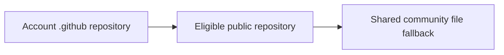

<!-- readme-refresh:start -->

  <picture>
    <source media="(prefers-color-scheme: dark)" srcset="assets/readme-banner.png">
    <source media="(prefers-color-scheme: light)" srcset="assets/readme-banner.png">
    
  </picture>

<h1 align="center">🧰 GitHub Community Configuration</h1>

  

  
  

> [!NOTE]
> This public repository is the home for account-level GitHub community files and their documentation. The current repository contains this overview and can grow as shared defaults are introduced.

## 🔎 At a glance

| | |
|---|---|
| **Owner** | [al1re3a](https://github.com/al1re3a) |
| **Purpose** | Shared GitHub repository defaults |
| **Visibility** | Public |
| **Status** | ✅ Active |

<strong>🧭 How GitHub resolves shared files</strong>

<!-- readme-refresh:end -->
